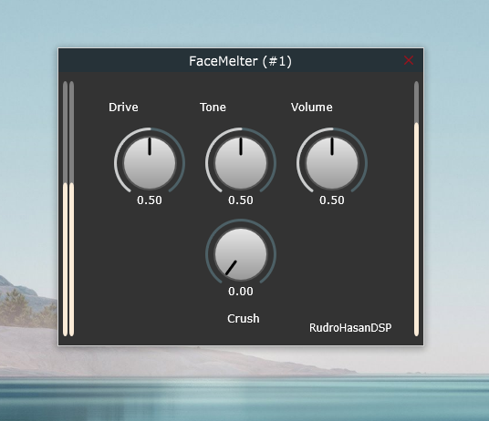

# FaceMelter

**FaceMelter** is a JUCE-based guitar distortion pedal plugin, designed to deliver an aggressive, high-gain sound that melts faces! This plugin is not a direct emulation of any existing hardware pedal but is inspired by various classic distortion circuits, combined with original tweaks for a unique sonic character.

## Features

- **High-Gain Distortion**: Dial up the heat with intense, saturated distortion.
- **Unique Tone Shaping**: Inspired by a blend of iconic guitar pedals, but with its own unique tonal footprint.
- **Customizable Parameters**: Adjust tone, distortion, and volume for flexible sound shaping.
- **Real-Time Processing**: Designed for low-latency performance in live and studio settings.
  
## Installation

Download Windows vst3 files here: https://github.com/Rudro085/FaceMelter/releases/tag/v1.0.0

## Screenshot

